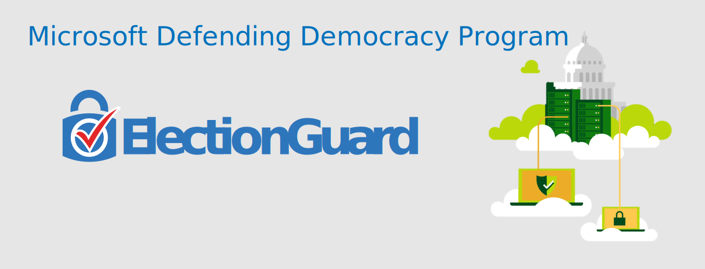

🗳️ ElectionGuard SDK C Implementation
=====================================

|Release| |License|

.. |Release| image:: https://github.com/microsoft/ElectionGuard-SDK-C-Implementation/workflows/Release/badge.svg

.. |License| image:: https://img.shields.io/github/license/microsoft/ElectionGuard-SDK-C-Implementation.svg
   :target: https://github.com/microsoft/ElectionGuard-SDK-C-Implementation/blob/master/LICENSE

---------------------

Note: This repository has been deprecated & transitioned
########################################################
As of 06/15/2020, this repository is no longer being actively maintained. ElectionGuard development has transitioned to the `ElectionGuard-Python <https://github.com/microsoft/electionguard-python>`_ Repo.

This repository will remain open sourced and available, but will no longer be actively maintained or updated. Development is underway for a replacement low-level language repository (C/C++) and updates will be posted here and on our `Main repository Page <https://github.com/microsoft/ElectionGuard>`_. This URL will become archived and read-only in Summer of 2020.

--------------------------

This is the core SDK that performs election functions such as vote encryption, decryption, key generation, and tallying. This code is meant to be run on voting system hardware and to be integrated into existing (or new) voting system software. The ElectionGuard SDK is written in C and is meant to add end-to-end verifiability and encryption into 3rd party comprehensive voting systems. There is also a simplistic, proof-of-concept C application to understand how the API should be called.

This implementation of the ElectionGuard SDK serves to showcase the API
provided by the SDK. It focuses on specifying and fixing the API so
programming against the
header files presented in the include document should allow you to
develop a voting system that is automatically improved
as the development of the ElectionGuard SDK continues.

This repository is pre-release. We look forward to engaging with the elections,
security, and software engineering communities to continue to improve it as
we move towards a full release.

For Documentation on how to use this API, visit `ElectionGuard C Documentation <https://aka.ms/ElectionGuard-Documentation>`_. Docs can also be compiled from this repository, see the "Documentation" section below.

For more details about the API, see the
:ref:`include`.

.. _building:

Building
--------

Windows
~~~~~~~~~~~~~

A file describing the build process for Windows can be found `here <README-windows.md>`_.

Unix-like Systems
~~~~~~~~~~~~~~~~~

First create a build directory and configure the build.

.. code:: sh

    mkdir build
    cmake -S . -B build

To build the SDK static library ``libelectionguard.a``, run

.. code:: sh

   cmake --build build

Alternatively there is a `Makefile` to wrap the cmake commands:

.. code:: sh

    make build

Testing
--------

Currently you can exercise the SDK by running the :doc:`api client
<examples/api>`. We include a cmake test to do so automatically. You can
also execute the client directly to better examine the output it produces.

.. warning::

  The current implementation allocates many things statically, leading
  to a large stack. This can cause stack-overflows as the size of elections grows.

  The size of the stack mostly depends on the value of :data:`MAX_TRUSTEES` in
  :file:`include/max_trustees.h`, so one way to fix the problem is to reduce
  that number and recompile.

  You can also increase the stack size, for example using :command:`ulimit`.

  In addition, this causes issues with :program:`valgrind`. The error messages
  are usually pretty helpful, and setting ``--main-stacksize`` and
  ``--main-stackframe`` according to its reccomendations usually fixes the issue.

Windows
~~~~~~~~~~~~~

A file describing the build process for Windows can be found `here <README-windows.md>`_.

Unix-like Systems
~~~~~~~~~~~~~~~~~

To build and run an example client of the SDK, run the tests:

.. code:: sh

    cmake --build build --target test

Alternatively you can build the client as a stand-alone project.
Create a separate build directory for the client, configure the build
to refer to the built library, and build the client.

.. code:: sh

   mkdir api_build
   ElectionGuard_DIR="$PWD/build/ElectionGuard" cmake -S examples/api -B api_build
   cmake --build api_build --target api

The built binary should be located at :file:`api_build/api`.

alternatively, you can use the convenience Makefile

.. code:: sh

    make run-api

Debugging
---------

To enable debug builds suitable for running with debuggers like
:program:`lldb`, set the ``CMAKE_BUILD_TYPE`` cmake variable to
``Debug`` when configuring. From the command-line, this looks like

.. code:: sh

    cmake -S . -B build -DCMAKE_BUILD_TYPE=Debug

Developing
----------

Some development tools like :program:`ccls` or :program:`cquery` use a
JSON file called :file:`compile_commands.json` to lookup which build
flags are used to build different files. To produce such a file while
compiling, set the ``CMAKE_EXPORT_COMPILE_COMMANDS`` cmake variable.
From the command-line, this looks like

.. code:: sh

   cmake -S . -B build -DCMAKE_EXPORT_COMPILE_COMMANDS=ON

Documentation
-------------

To build the HTML documentation, you will need to have
:program:`doxygen` installed, as well as :program:`python` with the
``sphinx`` and ``breathe`` packages. Then configure your build with
the ``BUILD_DOCUMENTATION`` variable set and rebuild.

.. note::

   Make sure that you've initialized :program:`git` submodules
   correctly. The theme used for the documentation is in a submodule.

   .. code:: sh

       git submodule update --init --recursive

.. code:: sh

    cmake -S . -B build -DBUILD_DOCUMENTATION=ON
    cmake --build build

and the documentation will be built in the :file:`build/docs/html`
directory. You can browse it locally by opening
:file:`build/docs/html/index.html`, or by running a local server

.. code::sh

    # python2
    (cd build/docs/html && python -m SimpleHTTPServer)

    # python3
    python3 -m http.server --directory build/docs/html

Memory Management/Ownership: Who frees what?
--------------------------------------------

Any pointers *returned by* functions in the SDK are considered to be
owned by the caller. This means that the SDK will retain no references
to them, and that the caller must free them when they are done.

Any pointers *passed to* functions in the SDK as arguments are
considered to be borrowed by the function, which means that they will
not be freed by that function, and it is still the responsibility of the
caller to free the pointer. This of course excludes functions whose
purpose is to free an opaque data type, like
:func:`KeyCeremony_Trustee_free()`.

This only applies when functions return with a successful status. If a
function returns with an error status, the client does not need to free
any memory that may have been allocated by the function; it will clean
up after itself.

Naming Conventions
------------------

All public functions are prefixed with the name of their “class” or
module, capitalized.

There are a few different kinds of types, and they each have their own
naming conventions. The rationale is that for types that we rely on the
fact that they are enums or structs, we should not ``typedef`` them so
that it is clear that they are enums and structs. If that changes, we
will have to go fix it everywhere, which is good, because now we cannot
rely on their representation anymore. Abstract types should be
``typedef``\ ed because we don’t rely on their implementation.

Abstract Type
~~~~~~~~~~~~~

A type whose implementation we want to be hidden from clients. This
means that it must be hidden behind a pointer so its size doesn’t need
to be known.

**Naming convention:** uppercase, with their structs suffixed with
``_s``.

.. code:: c

   typedef struct Car_s *Car;

Status Enum
~~~~~~~~~~~

A enum whose values represent possible statuses that we want to return.

**Naming convention:** prefixed by module or scope, then lowercase, and
no ``typedef``.

.. code:: c

   enum Car_status {
     CAR_SUCCESS,
     CAR_ON_FIRE,
   };

Return Struct
~~~~~~~~~~~~~

A struct whose sole purpose is to allow us to return multiple values,
often a status enum and a payload.

**Naming convention:** prefixed by module or scope, then lowercase, then
``_r``, and no ``typedef``. If only used for a single function, make the
name identical to the function name, then ``_r``. You can forward
declare in the return type.

.. code:: c

   struct Car_drive_r Car_drive(Car c);

   struct Car_drive_r {
     enum Car_status status;
     int x;
     int y;
   };

Internal Struct
~~~~~~~~~~~~~~~

A type we want to name, but whose implementation need not be hidden. In
fact, we might rely on the details of its representation.

**Naming convention:** all lowercase, no ``typedef``.

.. code:: c

   struct model {
     int year;
     enum color color;
   };

Current Limitations
--------------------

- Elections configurations are hard-coded. Later versions will be dynamically configurable by JSON input.
- Proof checks are sanity checks only, they are suitable to double check output from a trustworthy source, but not for a verifier.
- Election output is not yet structured for JSON output. Future versions will output data that will be compatible with our verifier specifications.
- The code is tested to be memory safe, however there are known memory leaks, these will be fixed in the next versions
- Decryption works by loading the entire election into memory. Due to the size of elections, this will not be desirable for larger elections.
- We use a dummy hash for the base hash, when JSON input is enabled, that must feed into the base hash
- We use RSA for sharing key-shares. Ideally ElGamal would be used, however it requires different parameters than the rest of the election.

Contributing
------------------

# Contributors

  * Matt Bauer: Initial executable specification, protocol feedback
  * David Christiansen: Informal walkthrough, Readme design
  * Joey Dodds: API refinement, SDK Crypography implementation
  * Jason Graalum: Team leadership and management
  * Kenny Foner: Demo encryption server, Rust verifier
  * Luke Myers: Schema design, Demo frontend integration
  * Stuart Pernsteiner: Rust verifier
  * Aaron Tomb: Executable specification
  * Jake Waksbaum: Schema design, Initial SDK implementation
  * Daniel Wagner: SDK Cryptography Implementation
  * Joe Kiniry: initial system design
